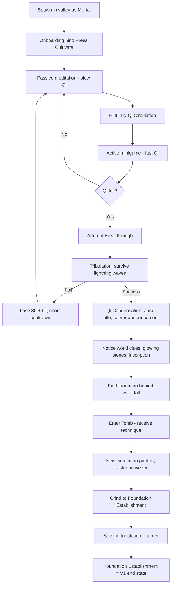
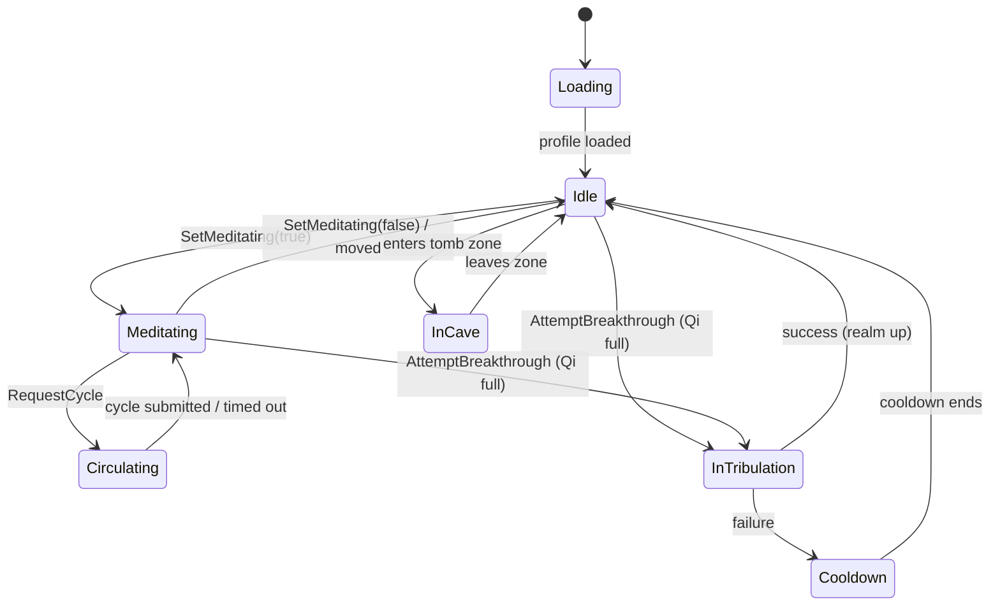
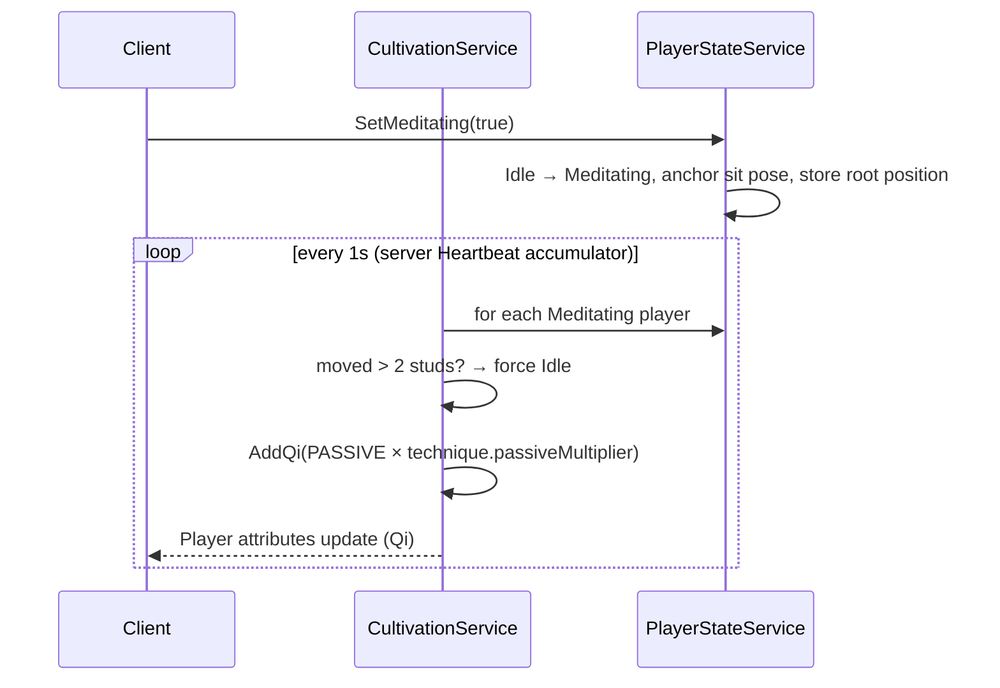
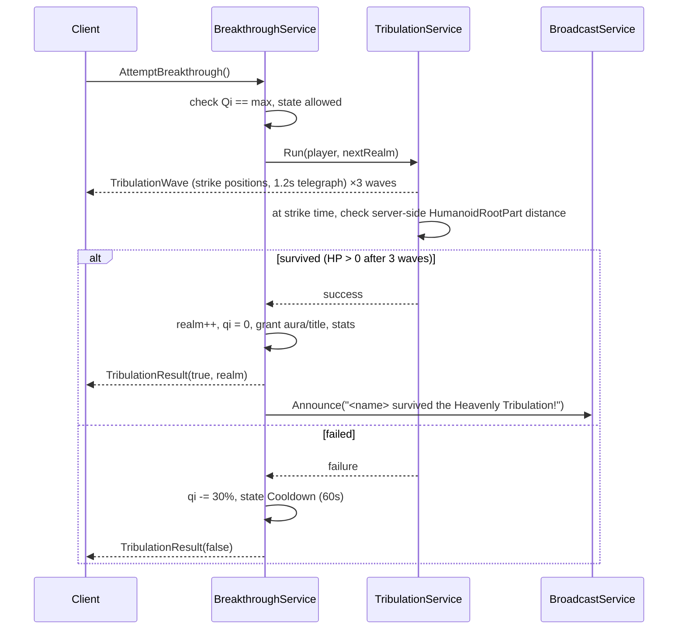
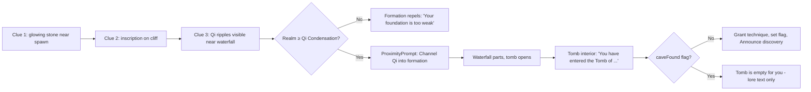

# Cultivation Roblox Game — Architecture & System Design

**Scope:** Version 1 ("first breakthrough" slice), with extension points for V2+ (sects, spirit beasts, PvP).
**Audience:** You (creative director) and Claude Code (primary builder). Claude should read this before every task.
**Companion docs:** `docs/design.md` (game design session summary), `docs/v1-roadmap.md` (phases and gates).

---

## 1. Requirements

### 1.1 Functional (V1)

| ID | Requirement |
| --- | --- |
| F1 | Player can start/stop **passive meditation**; Qi accumulates slowly on the server while seated. |
| F2 | Player can run **active Qi circulation** (timing minigame) for faster Qi gain, scored on accuracy and combo. |
| F3 | Three realms: **Mortal → Qi Condensation → Foundation Establishment**, each with a Qi threshold. |
| F4 | At full Qi, the player can attempt a **breakthrough** that triggers a survivable/failable **tribulation**. |
| F5 | Success grants a new realm, title, aura, and a **server-wide announcement**. Failure costs some Qi, never a realm. |
| F6 | A **hidden cave** behind the waterfall, found via world clues, grants a technique once per player. |
| F7 | The cave technique **changes the circulation pattern** and boosts active cultivation. |
| F8 | All progress **persists** across sessions and servers. |
| F9 | Other players can **see** your realm, title, and aura. |
| F10 | Works on **PC and mobile**. |

### 1.2 Non-functional

| Concern | Target |
| --- | --- |
| Authority | Server owns every number that matters (Qi, realm, techniques, flags). |
| Data safety | Zero data loss; session-locked profiles; schema versioned from day one. |
| Exploit resistance | Max Qi gain per second is capped server-side regardless of client input. |
| Performance | No per-frame remotes; server ticks at 1 Hz for cultivation; 60 FPS on mid-range phones. |
| Server size | 8–20 players per server. |
| Maintainability | Typed Luau (`--!strict`), one service per domain, all balance numbers in config. |

### 1.3 Constraints

- Solo developer, vibe coding with Claude Code + Roblox Studio MCP + Blender MCP.
- Part-time schedule (~8 weeks for V1).
- Free tooling except the Claude plan.
- **Roblox disconnects players after ~20 minutes without input.** Passive meditation is "AFK while tabbed out for a bit," not overnight AFK. Offline progression is an open V2 question (see §16).

---

## 2. Game Flow

### 2.1 First-session player journey



### 2.2 Core loop (repeats every realm)

```
        ┌──────────────────────────────────────────┐
        │                                          │
        ▼                                          │
   CULTIVATE ──► FILL QI ──► BREAKTHROUGH ──► NEW POWER/VISUALS
   (passive/active)            (tribulation)        │
        ▲                                           ▼
        └────────── EXPLORE / DISCOVER ◄────────────┘
                   (clues, cave, technique)
```

### 2.3 Target pacing

| Milestone | Target time (mixed play) |
| --- | --- |
| First Qi Circulation run | < 3 min |
| First breakthrough (Qi Condensation) | 8–12 min |
| Cave discovered | 15–25 min |
| Foundation Establishment | 30–45 min |

---

## 3. High-Level Architecture

```
┌─────────────────────────────── CLIENT (per player) ───────────────────────────────┐
│  Controllers                                                                       │
│  ┌──────────────┐ ┌─────────────────────┐ ┌──────────────┐ ┌───────────────────┐   │
│  │ Meditation   │ │ QiCirculation       │ │ Tribulation  │ │ UI / HUD / Notify │   │
│  │ Controller   │ │ Controller (game)   │ │ Controller   │ │ Controller        │   │
│  └──────┬───────┘ └─────────┬───────────┘ └──────┬───────┘ └─────────┬─────────┘   │
│         │  inputs only      │ hit timings        │ (visuals)         │ reads attrs │
└─────────┼───────────────────┼────────────────────┼───────────────────┼─────────────┘
          │                   │   Remotes (validated, rate-limited)    │
┌─────────┼───────────────────┼────────────────────┼───────────────────┼─────────────┐
│         ▼                   ▼                    ▼                   │   SERVER    │
│  ┌──────────────┐ ┌─────────────────────┐ ┌──────────────────┐       │             │
│  │ Cultivation  │ │ Circulation         │ │ Breakthrough     │       │             │
│  │ Service      │ │ Service (scoring)   │ │ Service + Trib.  │       │             │
│  └──────┬───────┘ └─────────┬───────────┘ └────────┬─────────┘       │             │
│         │                   │                      │                 │             │
│         ▼                   ▼                      ▼                 │             │
│  ┌──────────────────────────────────────────────────────────┐        │             │
│  │ PlayerStateService  (state machine + Player attributes)  │────────┘             │
│  └──────────────────────────┬───────────────────────────────┘  replicates          │
│                             ▼                                                      │
│  ┌──────────────────────────────────────────────────────────┐  ┌───────────────┐   │
│  │ DataService  (ProfileStore, schema, migrations)          │  │ CaveService   │   │
│  └──────────────────────────┬───────────────────────────────┘  │ Broadcast Svc │   │
│                             ▼                                  │ Analytics Svc │   │
│                     Roblox DataStores                          └───────────────┘   │
└────────────────────────────────────────────────────────────────────────────────────┘
          ▲
          │  Shared (both sides): config/Realms, config/Techniques, config/Balance,
          │  remotes/Remotes, types/Types, util/Formulas
```

**Principle:** the client is a *controller and a renderer*. It sends intents ("I want to meditate", "here are my hit timings") and draws what the server says is true.

---

## 4. Project Structure (Rojo)

```
cultivation-game/
├── CLAUDE.md
├── default.project.json
├── rokit.toml                      # pins Rojo version
├── docs/
│   ├── design.md
│   ├── v1-roadmap.md
│   ├── architecture.md             # this file
│   └── later.md                    # parking lot for out-of-scope ideas
├── src/
│   ├── server/                     # → ServerScriptService
│   │   ├── init.server.luau        # bootstrap
│   │   └── services/
│   │       ├── DataService.luau
│   │       ├── PlayerStateService.luau
│   │       ├── CultivationService.luau
│   │       ├── CirculationService.luau
│   │       ├── BreakthroughService.luau
│   │       ├── TribulationService.luau
│   │       ├── CaveService.luau
│   │       ├── BroadcastService.luau
│   │       └── AnalyticsService.luau   # wraps Roblox AnalyticsService
│   ├── client/                     # → StarterPlayerScripts
│   │   ├── init.client.luau
│   │   └── controllers/
│   │       ├── MeditationController.luau
│   │       ├── QiCirculationController.luau
│   │       ├── TribulationController.luau
│   │       ├── AuraController.luau
│   │       ├── UIController.luau
│   │       └── InputController.luau    # PC/mobile abstraction
│   └── shared/                     # → ReplicatedStorage.Shared
│       ├── config/
│       │   ├── Realms.luau
│       │   ├── Techniques.luau
│       │   └── Balance.luau
│       ├── remotes/Remotes.luau    # creates/fetches every remote by name
│       ├── types/Types.luau
│       └── util/
│           ├── Formulas.luau       # pure math, unit-testable
│           ├── RateLimiter.luau
│           └── Signal.luau
├── tests/                          # unit tests for pure modules
└── assets/
    ├── blender/                    # .blend source
    └── exports/                    # .fbx ready for Studio
```

### 4.1 Bootstrap pattern

Every service/controller exposes `Init()` (wire dependencies, no yielding) and `Start()` (connect events, begin loops). The bootstrap requires all modules, calls every `Init`, then every `Start`. This avoids require-order bugs, which AI-written code hits often.

```lua
-- src/server/init.server.luau
--!strict
local services = script.services
local order = {
	"DataService", "PlayerStateService", "AnalyticsService", "BroadcastService",
	"CultivationService", "CirculationService", "TribulationService",
	"BreakthroughService", "CaveService",
}
local loaded = {}
for _, name in order do
	loaded[name] = require(services[name])
end
for _, name in order do
	if loaded[name].Init then loaded[name]:Init(loaded) end
end
for _, name in order do
	if loaded[name].Start then task.spawn(loaded[name].Start, loaded[name]) end
end
```

---

## 5. Player State Machine

One authoritative state per player, owned by `PlayerStateService`. Every service checks state before acting, which prevents most "do two things at once" exploits.



| State | Allowed actions |
| --- | --- |
| Loading | none (all remotes rejected) |
| Idle | move, meditate, attempt breakthrough, enter cave |
| Meditating | passive Qi ticks, start circulation, stop |
| Circulating | submit current cycle only |
| InTribulation | movement only (dodge); no Qi gain |
| Cooldown | move, meditate (no breakthrough) |
| InCave | move, interact with tomb |

---

## 6. Server Services

| Service | Owns | Public API (server-side) |
| --- | --- | --- |
| **DataService** | ProfileStore profiles, schema, migrations, saving | `GetProfile(player)`, `Update(player, fn)`, `OnLoaded` signal |
| **PlayerStateService** | State machine, replicated Player attributes | `GetState`, `TrySetState(player, to)`, `SyncAttributes(player)` |
| **CultivationService** | Passive Qi tick, realm caps | `AddQi(player, amount, source)` (the **only** way Qi changes) |
| **CirculationService** | Minigame cycles: issue, validate, score | `RequestCycle`, `SubmitCycle` handlers |
| **BreakthroughService** | Eligibility, outcome, realm advancement | `Attempt(player)` |
| **TribulationService** | Tribulation waves, strike positions, hit detection | `Run(player, realmTo) -> success` |
| **CaveService** | Clues, formation unlock, technique grant | ProximityPrompt handlers |
| **BroadcastService** | Server-wide announcements | `Announce(text, style)` |
| **AnalyticsService** | Funnel/custom events for playtests | `Step(player, stepName)` |

### 6.1 `CultivationService.AddQi` — the single choke point

```lua
function CultivationService:AddQi(player: Player, amount: number, source: string)
	local maxQi = Realms.Get(profile.realm).qiToBreakthrough
	amount = math.clamp(amount, 0, Balance.MAX_QI_PER_CALL)
	if not self._rate:Allow(player, amount) then  -- rolling per-minute budget
		AnalyticsService:Flag(player, "qi_rate_exceeded", source)
		return
	end
	DataService:Update(player, function(data)
		data.qi = math.min(data.qi + amount, maxQi)
		data.stats.totalQi += amount
	end)
	PlayerStateService:SyncAttributes(player)
end
```

The rolling budget is set to the **theoretical max rate** (perfect circulation with the best technique) plus a small margin. Even a perfect bot can't exceed what a perfect human can do.

---

## 7. Client Controllers

| Controller | Responsibility |
| --- | --- |
| **InputController** | Maps PC (Space / click) and mobile (on-screen tap button) to one `Tap` signal. |
| **MeditationController** | Cultivate button, sit animation, sends `SetMeditating`. |
| **QiCirculationController** | Renders meridian path, animates pulse, collects tap timestamps, submits cycle, shows PERFECT/GREAT/combo feedback. |
| **TribulationController** | Sky/lighting changes, telegraph circles, lightning VFX, camera shake. Visual only; the server decides hits. |
| **AuraController** | Reads every player's `Realm` attribute and applies aura/title billboard. |
| **UIController** | HUD (Qi bar, realm, technique), notifications, announcements, breakthrough button. |

Client reads truth from **Player attributes** (`Realm`, `Qi`, `QiMax`, `State`, `Title`, `Technique`). Attributes replicate automatically, so no custom sync remote is needed. Qi is not secret, so it's fine for others to see it.

---

## 8. Networking Contract

All remotes live in `shared/remotes/Remotes.luau`. Every handler: (1) checks type of each arg, (2) checks player state, (3) applies `RateLimiter`, (4) does the work. Reject silently; log to analytics.

| Remote | Type | Direction | Args | Rate limit | Server checks |
| --- | --- | --- | --- | --- | --- |
| `SetMeditating` | RemoteEvent | C→S | `on: boolean` | 4/s | state is Idle or Meditating; character alive |
| `RequestCycle` | RemoteFunction | C→S | — | 1 per cycle duration | state Meditating; no open cycle |
| `SubmitCycle` | RemoteFunction | C→S | `cycleId: string, hits: {number}` | 1 per cycle | cycle owned, not expired, elapsed ≥ min duration, `#hits` ≤ nodes |
| `AttemptBreakthrough` | RemoteEvent | C→S | — | 1/5s | Qi full; state Idle/Meditating; not Cooldown |
| `TribulationWave` | RemoteEvent | S→C | wave data (positions, telegraph time) | — | — |
| `TribulationResult` | RemoteEvent | S→C | `success, newRealm?` | — | — |
| `Announce` | RemoteEvent | S→All | `text, style` | — | — |
| `Notify` | RemoteEvent | S→C | `text, kind` | — | — |

Cave interactions use **server-side ProximityPrompts**, so they need no custom remote.

---

## 9. Data Model

Stored with **ProfileStore** (session locking prevents duplicate/overwritten saves when a player hops servers).

```lua
-- shared/types/Types.luau
export type PlayerData = {
	schemaVersion: number,      -- bump + migrate on any shape change
	realm: string,              -- "Mortal" | "QiCondensation" | "FoundationEstablishment"
	qi: number,
	techniques: { string },     -- owned technique ids
	equippedTechnique: string,
	flags: {
		caveFound: boolean,
		tutorialDone: boolean,
	},
	stats: {
		totalQi: number,
		playSeconds: number,
		cyclesCompleted: number,
		perfectHits: number,
		tribulationsPassed: number,
		tribulationsFailed: number,
	},
}

local DEFAULT: PlayerData = {
	schemaVersion = 1,
	realm = "Mortal",
	qi = 0,
	techniques = { "BasicQiGathering" },
	equippedTechnique = "BasicQiGathering",
	flags = { caveFound = false, tutorialDone = false },
	stats = { totalQi = 0, playSeconds = 0, cyclesCompleted = 0,
	          perfectHits = 0, tribulationsPassed = 0, tribulationsFailed = 0 },
}
```

### 9.1 Migration rule

`DataService` runs migrations on load: `while data.schemaVersion < CURRENT do data = Migrations[data.schemaVersion](data) end`. Never rename or delete a field without a migration. Reserve top-level keys now for V2 (`sect`, `beasts`, `inventory`) so they're added, not restructured.

---

## 10. Configuration

### 10.1 Realms

```lua
-- shared/config/Realms.luau
return {
	order = { "Mortal", "QiCondensation", "FoundationEstablishment" },
	data = {
		Mortal = { display = "Mortal", qiToBreakthrough = 1500,
		           tribulation = "Minor" },
		QiCondensation = { display = "Qi Condensation", qiToBreakthrough = 7500,
		                   tribulation = "Lesser", aura = "QiWisps", title = "Qi Condensation Cultivator" },
		FoundationEstablishment = { display = "Foundation Establishment", qiToBreakthrough = math.huge,
		                            aura = "FoundationGlow", title = "Foundation Establishment Cultivator" },
	},
}
```

### 10.2 Techniques

```lua
-- shared/config/Techniques.luau
return {
	BasicQiGathering = {
		display = "Basic Qi Gathering Technique",
		pattern = { "Dantian", "Core", "Head", "Core", "Dantian" },
		tempo = 1.0,             -- seconds between nodes
		activeMultiplier = 1.0,
		passiveMultiplier = 1.0,
	},
	-- granted by the hidden cave (name is a placeholder)
	BlackSwordBreath = {
		display = "Black Sword Ancestor's Breathing Art",
		pattern = { "Dantian", "Core", "LeftArm", "Head", "RightArm", "Core", "Dantian" },
		tempo = 0.75,            -- faster, harder, more rewarding
		activeMultiplier = 1.5,
		passiveMultiplier = 1.1,
	},
}
```

### 10.3 Balance (starting values, tune in playtests)

```lua
-- shared/config/Balance.luau
return {
	PASSIVE_QI_PER_SEC = 1.5,
	ACTIVE_BASE_QI_PER_NODE = 6,
	PERFECT_WINDOW = 0.08,       -- ±seconds
	GREAT_WINDOW = 0.16,
	PERFECT_SCORE = 1.0,
	GREAT_SCORE = 0.6,
	COMBO_STEP = 0.05,           -- +5% per consecutive perfect/great
	COMBO_MAX = 2.0,             -- multiplier cap
	CYCLE_TIMEOUT = 15,          -- seconds
	TRIBULATION_FAIL_QI_LOSS = 0.30,
	TRIBULATION_COOLDOWN = 60,
	MAX_QI_PER_CALL = 500,
	QI_BUDGET_MARGIN = 1.15,     -- 15% over theoretical max
}
```

### 10.4 Pacing math

```
Total Qi to reach Foundation Establishment = 1,500 + 7,500 = 9,000

Passive only:     9,000 / 1.5 Qi/s           ≈ 100 min   (slow, safe)
Mixed play:       ~5 Qi/s average            ≈ 30 min    (target)
Skilled active:   ~8–10 Qi/s with cave tech  ≈ 15–20 min
```

Active Qi per node = `ACTIVE_BASE_QI_PER_NODE × hitScore × comboMultiplier × technique.activeMultiplier`. Keep this formula in `Formulas.luau` as a pure function so it can be unit-tested and tuned.

---

## 11. Key Sequences

### 11.1 Passive meditation tick



### 11.2 Active Qi circulation (anti-cheat aware)

```mermaid
sequenceDiagram
    participant C as QiCirculationController
    participant S as CirculationService
    C->>S: RequestCycle()
    S->>S: state Meditating → Circulating; create cycle {id, pattern, tempo, issuedAt}
    S-->>C: {cycleId, pattern, tempo}
    C->>C: animate pulse, record tap offsets per node
    C->>S: SubmitCycle(cycleId, hits)
    S->>S: validate owner, not expired, elapsed ≥ #pattern × tempo × 0.9
    S->>S: clamp each offset, score via Formulas, apply combo
    S->>S: CultivationService.AddQi(total) (rate budget applies)
    S-->>C: {score per node, combo, qiGained}
    S->>S: Circulating → Meditating
```

**Why this design:** the server sets the pattern and tempo and checks that real time passed. A cheater can at most submit "perfect" hits every cycle, and the rate budget already assumes perfect play. Faking speed is impossible because the server measures elapsed time itself.

### 11.3 Breakthrough and tribulation



Hits are decided on the server using the character's server-side position, so the client can't claim to dodge. Telegraph circles give a fair reaction window despite latency.

### 11.4 Hidden cave discovery



Clues are parts tagged with `CollectionService` (`Clue`, `CaveFormation`) so you and Claude can place and move them in Studio without editing code.

---

## 12. World & Asset Pipeline

### 12.1 V1 map layout

```
   [Cliff + Inscription]           [Waterfall + Hidden Formation]
            │                                  │
   ─────────┴──────── Forest path ─────────────┴──────
            │                                  │
   [Meditation Platform]  ◄── Spawn Valley ──► [Tribulation Plateau]
            │
     [Glowing Stone clue]
```

### 12.2 Blender → Roblox

1. Claude builds low-poly asset in Blender via MCP (blender-skills pack).
2. Apply transforms, keep under ~10k triangles per prop, one material per mesh where possible.
3. Export FBX to `assets/exports/<Category>_<Name>.fbx`.
4. Import in Studio via 3D Importer; store under `ServerStorage/Assets` or `Workspace/Map`.
5. Tag interactive parts with CollectionService; never hard-code instance paths in scripts.

**Art direction (keep consistent):** stylized low-poly, jade green + gold + misty white palette, soft fog, warm lighting. VFX (auras, lightning) built in Studio with ParticleEmitters and Beams, not Blender.

### 12.3 Animations

- Meditation sit (loop), circulation hand seal (loop), breakthrough burst (one-shot), tribulation brace (one-shot).
- R15, authored in Blender (optional animation skill) or Studio Animation Editor; IDs stored in `shared/config/Animations.luau`.

---

## 13. Performance

- Cultivation ticks at 1 Hz on the server, batched over all players in one loop.
- No RemoteEvent fires per frame; circulation sends one submit per cycle.
- Attribute updates only when values change.
- Particle budgets: aura ≤ 30 particles per player; reduce on mobile (`UserInputService.TouchEnabled`).
- StreamingEnabled on; tribulation VFX only for players within render distance.

---

## 14. Reliability, Logging, Testing

| Area | Approach |
| --- | --- |
| Save failures | ProfileStore handles retries; on load failure, kick with a friendly message rather than playing on an empty profile. |
| Shutdowns | `game:BindToClose` releases all profiles. |
| Logging | One `Log` util with levels; warnings for rejected remotes include player id and reason. |
| Analytics | Funnel steps: `Joined → FirstMeditate → FirstCycle → Breakthrough1 → CaveFound → Breakthrough2`. These give your playtest numbers automatically. |
| Unit tests | Pure modules (`Formulas`, `RateLimiter`, migrations) tested with a Luau test framework. |
| Playtest checklist | After every phase: rejoin test, two-player test, mobile test, Output window clean. |

---

## 15. Extension Points for V2+

Designed now so V2 adds instead of rewrites.

| Feature | Hook already in V1 | V2 work |
| --- | --- | --- |
| **Spirit beasts** | `beasts` key reserved in schema; `AddQi(source)` can accept beast bonuses | BeastService, egg hatching, bond levels, follow AI |
| **Sects** | `sect` key reserved; BroadcastService exists | Cross-server sect data in DataStore + MemoryStore, MessagingService for live updates, rank permissions table |
| **Sect formation cultivation** | Circulation already server-scored | Group cycle that scores all participants together |
| **More realms** | Realms is pure config | Add entries + tribulation types |
| **More caves / rotating discoveries** | CaveService uses tags, not paths | Per-server random activation, time-limited spawns |
| **Forbidden cultivation** | `AddQi` choke point + state machine | New technique flag with risk roll on breakthrough |
| **PvP** | State machine gates actions | Combat state, damage service, realm-gap protections |
| **Monetization** | All boosts flow through multipliers | Cosmetic auras, gamepasses (never sell raw power) |

---

## 16. Key Decisions & Trade-offs

| Decision | Chosen | Alternative | Why |
| --- | --- | --- | --- |
| Data library | ProfileStore | Raw DataStore | Session locking and retries are where hand-rolled code loses data. |
| State replication | Player attributes | Custom replicator remote | Less code, auto-replicates, easy for AI to get right. Revisit if data becomes private or large. |
| Module framework | Plain Init/Start modules | Knit or other frameworks | Fewer abstractions for Claude to misuse; easy to read. |
| Code location | Rojo + Git | Studio-only scripts | Rollback and history are essential when AI makes big edits. |
| Minigame validation | Server-issued cycle + time check + rate budget | Full input replay simulation | Much simpler; the budget caps the worst case anyway. |
| Tribulation hits | Server-side position checks | Client-reported dodges | Can't be faked; telegraphs offset latency. |

---

## 17. Open Questions

- Offline/AFK progression given Roblox's ~20-minute idle disconnect: none, capped offline gains, or a "closed-door meditation" item?
- Final game name, realm names, and the cave's ancestor name.
- Should tribulation failure ever risk more than Qi (e.g. temporary meridian damage debuff)?
- Do other players get anything from watching or helping during someone's tribulation?
- Mobile minigame layout: single tap button vs tapping nodes directly on the meridian diagram.
